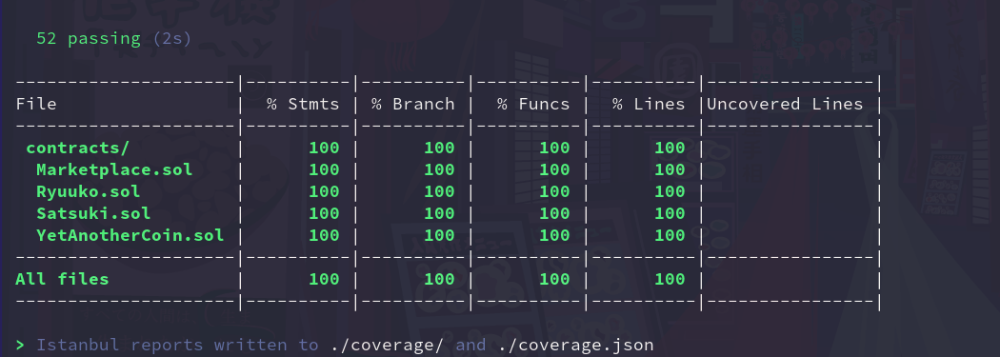
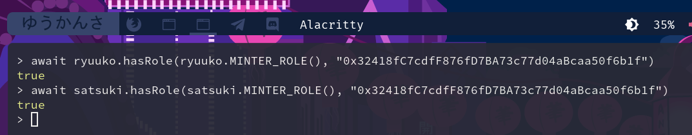

# Token Marketplace 💰

A mock ERC-721/ERC-1155 marketplace.

## Features

This project includes 4 separate contracts:

  - Ryuuko.sol — a mock ERC-721 token.
  - Satsuki.sol — a mock ERC-1155 token.
  - YetAnotherCoin.sol — a ERC-20 token which is used to pay in the marketplace, [taken from my previous project.](https://github.com/SfyMantissa/YetAnotherCoin)
  - Marketplace.sol — the marketplace contract itself.

Marketplace is allowed to mint Ryuuko and Satsuki tokens using [OpenZeppelin Access Control.](https://docs.openzeppelin.com/contracts/4.x/access-control)

- Ryuuko token:
  - [x] Deployed @0x37b7c60cfFCd07a975109744cd46a7fC06a77B9a in Rinkeby testnet.
  - [x] Available on [OpenSea](https://testnets.opensea.io/collection/ryuuko-fgtzqzqfo2) and [Rarible.](https://rinkeby.rarible.com/collection/0x37b7c60cffcd07a975109744cd46a7fc06a77b9a/items)
  - [x] Verified on [Etherscan.](https://rinkeby.etherscan.io/address/0x37b7c60cfFCd07a975109744cd46a7fC06a77B9a#code)
  - [x] Fully covered with tests (located in _test/ryuuko-test.ts_).
  - [x] Fully covered with tasks (located in _tasks/ryuuko/_).
  - [x] All ABI interfaces are covered by NatSpec annotations.
  - [x] Generated comprehensive Markdown documentation (located in _docs/Ryuuko.md_).

- Satsuki token: 
  - [x] Deployed @0xbb57dAB3E39828C4A75F88eEc3a9942A5cc74B5F in Rinkeby testnet.
  - [x] Available on [OpenSea](https://testnets.opensea.io/collection/satsuki-tsuyaby639) and [Rarible.](https://rinkeby.rarible.com/collection/0xbb57dab3e39828c4a75f88eec3a9942a5cc74b5f/items)
  - [x] Verified on [Etherscan.](https://rinkeby.etherscan.io/address/0xbb57dAB3E39828C4A75F88eEc3a9942A5cc74B5F#code)
  - [x] Fully covered with tests (located in _test/satsuki-test.ts_).
  - [x] Fully covered with tasks (located in _tasks/satsuki/_).
  - [x] All ABI interfaces are covered by NatSpec annotations.
  - [x] Generated comprehensive Markdown documentation (located in _docs/Satsuki.md_).

- YetAnotherCoin token:
  - [x] Deployed @0xB89F9f4Da44E29D8A60dC97038E220E3f7642C42 in Rinkeby testnet.
  - [x] Verified on [Etherscan.](https://rinkeby.etherscan.io/address/0xB89F9f4Da44E29D8A60dC97038E220E3f7642C42#code)
  - [x] Fully covered with tests (located in _test/yet-another-coin-test.ts_).
  - [x] All ABI interfaces are covered by NatSpec annotations.
  - [x] Generated comprehensive Markdown documentation (located in _docs/YetAnotherCoin.md_).

- Marketplace:
  - [x] Deployed @0x32418fC7cdfF876fD7BA73c77d04aBcaa50f6b1f in Rinkeby testnet.
  - [x] Verified on [Etherscan.](https://rinkeby.etherscan.io/address/0x32418fC7cdfF876fD7BA73c77d04aBcaa50f6b1f#code)
  - [x] Fully covered with tests (located in _test/marketplace-test.ts_).
  - [x] Fully covered with tasks (located in _tasks/marketplace/_).
  - [ ] All ABI interfaces are covered by NatSpec annotations.
  - [ ] Generated comprehensive Markdown documentation (located in _docs/Marketplace.md_).
  - [x] Minter role granted by both Ryuuko and Satsuki contracts.

## Demonstration

